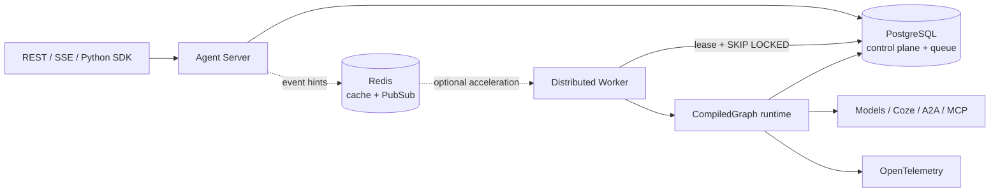

# LingxiGraph

<div align="center">

**A production-grade, provider-neutral durable graph runtime for multi-agent systems**

[简体中文](README.md) · [Quickstart](Wiki/en/quickstart/installation.mdx) · [Documentation](Wiki/en/index.mdx) · [API reference](Wiki/en/api/overview.mdx) · [Changelog](CHANGELOG.md)

[](https://github.com/LingXi-Org/LingxiGraph/actions/workflows/ci.yml)
[](https://www.python.org/)
[](LICENSE)
[](CHANGELOG.md)

</div>

LingxiGraph turns ordinary Python functions into stateful graphs that are durable, resumable, and observable in real time. Use the dependency-free core inside an application, or run the complete Agent Server, distributed workers, PostgreSQL queue, and Studio debugger.

It is designed for long-running agents that need human approval, parallel collaboration, failure recovery, and strict tenant isolation—without coupling your application to a model SDK, prompt platform, or cloud vendor.

## Why LingxiGraph

- **Deterministic graph runtime** — Pregel-style `plan → execute → commit` supersteps with deterministic merging of parallel updates.
- **Durable execution** — typed checkpoints, pending writes, history, replay, forks, and deeply nested subgraph namespaces.
- **Provider-neutral agents** — neutral messages and `ChatModel`, typed tools, a prebuilt ReAct loop, HITL approval, and structured output.
- **Multi-agent patterns** — supervisor, handoff, swarm, group chat, plan-and-execute, parallel review, and map-reduce.
- **Production control plane** — version pinning, PostgreSQL leases, idempotency, dead-letter/redrive, budgets, quotas, and cooperative cancellation.
- **Open interfaces** — REST, resumable SSE, Python SDK, A2A, MCP, Coze, and OpenAI-compatible adapters.
- **Secure and observable** — OIDC/JWT, RBAC, tenant isolation, PostgreSQL RLS, audit records, JSON logs, and OpenTelemetry.
- **Developer friendly** — scaffolding, an in-memory dev stack, hot reload, embedded Studio, Docker Compose, and Helm.

## Start in 30 seconds

Python 3.11 or later is required.

```bash
pip install lingxigraph
```

```python
from typing import TypedDict

from lingxigraph import END, START, Runtime, StateGraph


class State(TypedDict):
    request: str
    result: str


class Context(TypedDict):
    tenant: str


def resolve(state: State, runtime: Runtime[Context]):
    runtime.stream_writer({"stage": "resolving"})
    return {"result": f"{runtime.context['tenant']}: {state['request']}"}


builder = StateGraph(State, context_schema=Context, name="support", version="1.0.0")
builder.add_node("resolve", resolve, timeout=30)
builder.add_edge(START, "resolve").add_edge("resolve", END)
graph = builder.compile()

print(graph.invoke(
    {"request": "reset access", "result": ""},
    context={"tenant": "acme"},
))
```

Expected output:

```text
{'request': 'reset access', 'result': 'acme: reset access'}
```

Use `runtime.idempotency_key` to deduplicate production side effects downstream. State commits are idempotent; external network calls use at-least-once semantics.

## Choose a runtime mode

| Use case | Install or command | Best for |
| --- | --- | --- |
| Embedded Python | `pip install lingxigraph` | Local execution, tests, library integration |
| Local agent development | `pip install "lingxigraph[server]"` + `lingxigraph dev` | In-memory storage, embedded worker, Studio |
| Single-server production | `docker compose up --build` | PostgreSQL, Redis, API, worker, Studio |
| Independent scaling | `lingxigraph server` / `lingxigraph worker` | Multi-process or Kubernetes deployments |

Scaffold a runnable agent project:

```bash
lingxigraph new my-agent
cd my-agent
pip install -e .
lingxigraph dev
```

Open `http://localhost:8124/studio/` to inspect real graph topology, SSE execution traces, thread state, checkpoints, interrupts, and resumes.

## Agents and tools

The core package has no model-provider dependency. A model implements `ChatModel.agenerate()` and optionally `astream()`. Python annotations become the tool JSON Schema; permissions, secret injection, timeouts, and human approval are enforced at the tool boundary.

```python
from lingxigraph import HumanMessage, create_agent, tool


@tool(permissions=("knowledge:read",), timeout=10)
def search(query: str) -> str:
    """Search the internal knowledge base."""
    return f"result for {query}"


agent = create_agent(model, [search], system_prompt="You are a support agent.")
result = agent.invoke(
    {"messages": [HumanMessage("Find the refund policy")]},
    {"tool_permissions": ["knowledge:read"], "max_tool_calls": 4},
)
```

Install official adapters only when needed:

```bash
pip install "lingxigraph[coze]"      # Coze Bot / Workflow / ChatModel
pip install "lingxigraph[openai]"    # OpenAI-compatible ChatModel
pip install "lingxigraph[all]"       # Complete server and integration stack
```

## Architecture



PostgreSQL is the source of truth for queue, event, and state data. Redis only accelerates caching, rate limiting, cancellation, and event notification. If Redis is unavailable, tasks and SSE fall back to database polling without compromising durable state.

## Documentation

The complete bilingual documentation lives in the prominent [`Wiki/`](Wiki/README.md) directory and can be previewed or deployed directly with Mintlify.

| English | 中文 |
| --- | --- |
| [Installation](Wiki/en/quickstart/installation.mdx) | [安装](Wiki/zh/quickstart/installation.mdx) |
| [Build your first graph](Wiki/en/quickstart/first-graph.mdx) | [创建第一个图](Wiki/zh/quickstart/first-graph.mdx) |
| [Agent Server](Wiki/en/quickstart/agent-server.mdx) | [Agent Server](Wiki/zh/quickstart/agent-server.mdx) |
| [Core concepts](Wiki/en/concepts/architecture.mdx) | [核心概念](Wiki/zh/concepts/architecture.mdx) |
| [REST / SSE API](Wiki/en/api/overview.mdx) | [REST / SSE API](Wiki/zh/api/overview.mdx) |
| [Production deployment](Wiki/en/guides/deployment.mdx) | [生产部署](Wiki/zh/guides/deployment.mdx) |

Preview the docs locally:

```bash
cd Wiki
npx mintlify dev
```

## Development

```bash
git clone https://github.com/LingXi-Org/LingxiGraph.git
cd LingxiGraph
python -m venv .venv
# Linux/macOS: source .venv/bin/activate
# Windows: .venv\Scripts\activate
pip install -e ".[dev,all]"
pytest
ruff check src tests
mypy src/lingxigraph
```

CI covers Python 3.11 and 3.13, unit and integration tests, Ruff, mypy, an 80% branch-coverage gate, dependency audit, image scanning, and CycloneDX SBOM generation. PostgreSQL/Redis integration tests require Docker.

## Compatibility and stability

- Python: 3.11, 3.12, and 3.13.
- API: versioned under `/v1`; errors expose stable `code` and `retryable` fields.
- State: safe typed JSON serialization; production state never relies on pickle.
- Releases: every run pins its graph ID and version, so rolling upgrades do not alter queued or paused executions.

## Contributing

Read the [contribution guide](Wiki/en/contributing.mdx) before submitting changes. Do not disclose vulnerabilities publicly; follow the private process in the [security guide](Wiki/en/operations/security-observability.mdx).

## License

LingxiGraph is released under the [MIT License](LICENSE).
