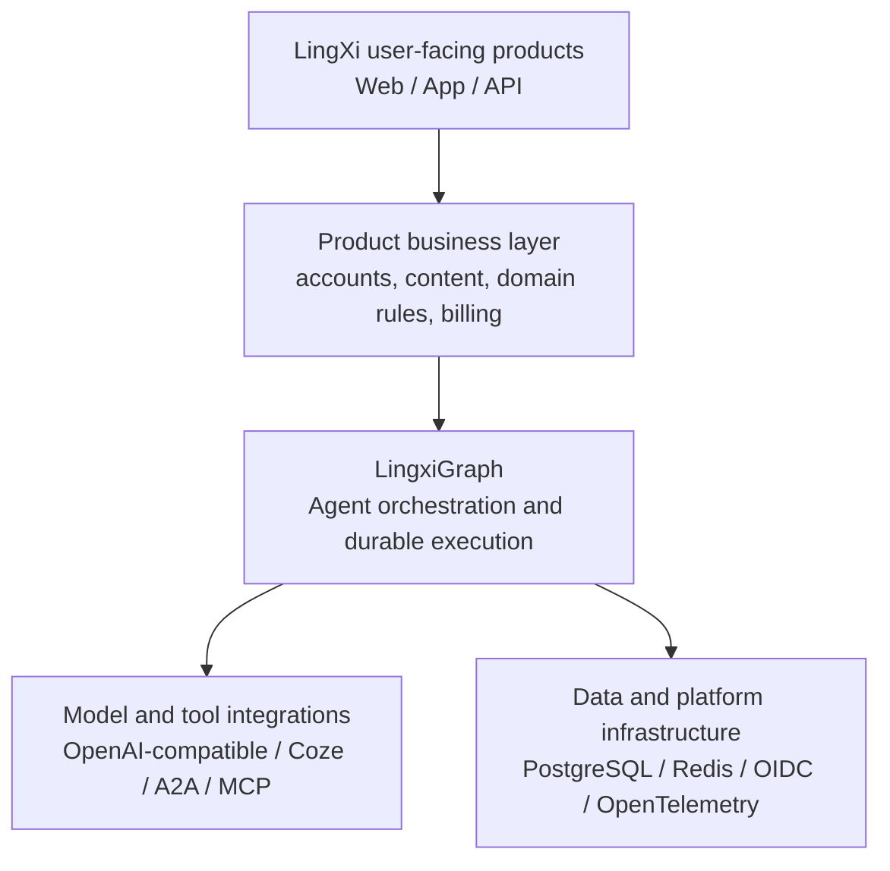
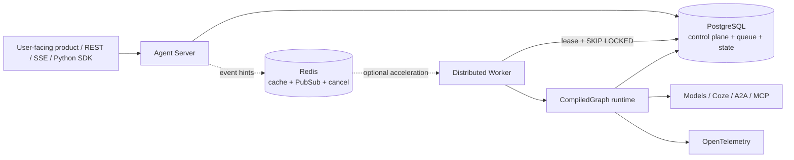

# LingxiGraph

<div align="center">

**The production-grade Agent application runtime for user-facing intelligent products in the LingXi stack**

<nav aria-label="Language and documentation navigation">
  <a href="README.md">中文 README</a> ·
  <a href="Wiki/content/docs/en/index.mdx">English docs</a> ·
  <a href="Wiki/content/docs/zh/index.mdx">中文文档</a> ·
  <a href="Wiki/content/docs/en/quickstart/installation.mdx">Quickstart</a> ·
  <a href="Wiki/content/docs/en/api/overview.mdx">API reference</a> ·
  <a href="CHANGELOG.md">Changelog</a>
</nav>

[](https://github.com/LingXi-Org/LingxiGraph/actions/workflows/ci.yml)
[](https://www.python.org/)
[](LICENSE)
[](CHANGELOG.md)

</div>

LingxiGraph is the production-grade Agent runtime for building user-facing online AI product capabilities across the LingXi product family. It turns ordinary Python functions into composable, durable, resumable, and observable state graphs, then serves real user traffic through Agent Server, workers, PostgreSQL, and open protocols.

It sits between a user-facing product’s business API and its models, tools, and data infrastructure. LingxiGraph owns how a user request is executed, paused, resumed, retried, and audited; it does not own the end-user UI, domain rules, billing, or model training. The core is provider-neutral and does not require a model SDK, prompt platform, or cloud vendor, allowing LingXi products to share a reliable execution layer while evolving independently.

<table>
  <tr>
    <td width="33%" valign="top"><strong>Orchestration</strong><br />Compose agents, tools, and business nodes into traceable state graphs.</td>
    <td width="33%" valign="top"><strong>Durable execution</strong><br />Provide one runtime model for sessions, long-running work, resumes, and live events.</td>
    <td width="33%" valign="top"><strong>Platform governance</strong><br />Serve product traffic within tenant, permission, quota, audit, and observability boundaries.</td>
  </tr>
</table>

## Position in the LingXi stack


```mermaid
flowchart TB
  Product["LingXi user-facing products\nWeb / App / API"] --> BFF["Product business layer\naccounts, content, domain rules, billing"]
  BFF --> Graph["LingxiGraph\nAgent orchestration and durable execution"]
  Graph --> Providers["Model and tool integrations\nOpenAI-compatible / Coze / A2A / MCP"]
  Graph --> Data["Data and platform infrastructure\nPostgreSQL / Redis / OIDC / OpenTelemetry"]
```

| Stack layer | Primary responsibility | LingxiGraph boundary |
| --- | --- | --- |
| User-facing product | User experience, accounts, content, domain workflows, and monetization | Consumes REST, SSE, or the Python SDK; does not include product UI |
| Product business layer | User-to-tenant mapping, domain data, billing, and policy | Supplies agent context, tools, and authorization policy |
| Agent runtime layer | Graph orchestration, agent collaboration, state, runs, recovery, and telemetry | LingxiGraph’s core responsibility |
| Model and tool layer | LLMs, retrieval, third-party APIs, and remote agents | Connects through `ChatModel`, tools, A2A, MCP, and optional adapters |
| Platform infrastructure | Database, cache, identity, logs, and traces | Uses PostgreSQL as the durable source of truth and Redis as optional acceleration |

## Value for user-facing online products

LingxiGraph is for product and platform teams that need to deliver Agent experiences reliably to end users. It focuses on the engineering problems that appear after a model call works in a prototype:

- **Continuous user experiences** — threads, checkpoints, history, forks, resumes, and resumable SSE support multi-turn sessions, long-running work, and reconnects.
- **Durable mid-run steering** — inject new structured input into a running (or paused) run without cancelling it; delivery is durable, ordered, deduplicated, and survives worker crashes and paused-run resumes.
- **Composable intelligent workflows** — state graphs, subgraphs, and supervisor, handoff, swarm, group chat, plan-and-execute, parallel-review, and map-reduce patterns organize complex requests.
- **Governed production execution** — pinned graph versions, lease-based queues, idempotency keys, timeouts, budgets, quotas, dead-letter/redrive, and cooperative cancellation make retries and scaling manageable.
- **Tenant-aware security boundaries** — OIDC/JWT, RBAC, tenant isolation, PostgreSQL RLS, audit records, and safe JSON state serialization provide runtime foundations for data isolation in online products.
- **Provider portability** — models follow the neutral `ChatModel` protocol; Coze, OpenAI-compatible, A2A, and MCP integrations remain optional boundaries that reduce vendor lock-in.
- **Cost and context governance** — cache-first prompts, prefix-drift diagnostics, normalized usage, history hygiene, and context compaction help platform teams manage context and inference cost.

Typical integrations include multi-turn assistants, task-oriented end-user agents, long-running workflows with live progress, high-risk actions with human intervention, and multi-agent collaboration. Product-specific domain logic, data permissions, and user interfaces remain responsibilities of the owning LingXi product.

## Scope and boundaries

| Included | Owned by the product or surrounding platform |
| --- | --- |
| Graph and Agent orchestration, execution, state, and events | Web/App UI, user registration, login, and navigation |
| Agent Server, distributed workers, queues, and Studio | Domain data models, content systems, orders, and billing |
| REST, resumable SSE, Python SDK, A2A, and MCP | Model accounts, vendor contracts, and model training |
| OIDC/JWT, RBAC, tenant isolation, quotas, and audit | Production secrets, network policy, and compliance processes |
| PostgreSQL durability and optional Redis acceleration | Sandboxed execution of untrusted tenant code |

The current release does not provide online Python uploads, a multi-tenant code sandbox, or micro-VM isolation. Workers execute trusted graphs registered from an image or signed artifact. Run untrusted code in a separate sandbox with least-privilege identity and controlled network egress outside LingxiGraph.

## Start in 30 seconds

Python 3.11 or later is required.

```bash
pip install lingxigraph
```

```python
from typing import TypedDict

from lingxigraph import END, START, Runtime, StateGraph


class State(TypedDict):
    request: str
    result: str


class Context(TypedDict):
    tenant: str


def resolve(state: State, runtime: Runtime[Context]):
    runtime.stream_writer({"stage": "resolving"})
    return {"result": f"{runtime.context['tenant']}: {state['request']}"}


builder = StateGraph(State, context_schema=Context, name="support", version="1.0.0")
builder.add_node("resolve", resolve, timeout=30)
builder.add_edge(START, "resolve").add_edge("resolve", END)
graph = builder.compile()

print(graph.invoke(
    {"request": "reset access", "result": ""},
    context={"tenant": "acme"},
))
```

Expected output:

```text
{'request': 'reset access', 'result': 'acme: reset access'}
```

Use `runtime.idempotency_key` to deduplicate production side effects downstream. State commits are idempotent; external network calls use at-least-once semantics and are not automatically rolled back by the runtime.

## Choose a runtime mode

| Use case | Install or command | Best for |
| --- | --- | --- |
| Embedded Python | `pip install lingxigraph` | Local execution, tests, and library integration |
| Local agent development | `pip install "lingxigraph[server]"` + `lingxigraph dev` | In-memory storage, embedded worker, and Studio |
| Single-server production baseline | `docker compose up --build` | PostgreSQL, Redis, API, worker, and Studio |
| Independent scaling | `lingxigraph server` / `lingxigraph worker` | Multi-process or Kubernetes deployments |

Scaffold a runnable agent project:

```bash
lingxigraph new my-agent
cd my-agent
pip install -e .
lingxigraph dev
```

Open `http://localhost:8124/studio/` to inspect graph topology, SSE execution traces, thread state, checkpoints, interrupts, and resumes.

## Agents, tools, and open Skills

The core package has no model-provider dependency. A model implements `ChatModel.agenerate()` and optionally `astream()`. Python annotations become the tool JSON Schema; permissions, secret injection, timeouts, and human approval are enforced at the tool boundary.

```python
from lingxigraph import HumanMessage, create_agent, tool


@tool(permissions=("knowledge:read",), timeout=10)
def search(query: str) -> str:
    """Search the internal knowledge base."""
    return f"result for {query}"


agent = create_agent(model, [search], system_prompt="You are a support agent.")
result = agent.invoke(
    {"messages": [HumanMessage("Find the refund policy")]},
    {"tool_permissions": ["knowledge:read"], "max_tool_calls": 4},
)
```

LingxiGraph reads the open Agent Skills directory format directly and introduces no private manifest. At startup, the agent sees only each Skill’s `name` and `description`; it loads resources through ordinary `read_skill` and `read_skill_resource` tool calls. A Skill’s `allowed-tools` value is advisory and cannot bypass tool permissions, dynamic authorization, HITL, timeouts, or budgets.

```python
from lingxigraph import FilesystemSkillSource, HumanMessage, create_agent

agent = create_agent(
    model,
    tools=[search],
    skills=FilesystemSkillSource("skills"),
)
result = agent.invoke({"messages": [HumanMessage("Greet me in Chinese")]})
```

See [`skills/hello/SKILL.md`](skills/hello/SKILL.md) and [`examples/react_agent_skills.py`](examples/react_agent_skills.py) for a complete example.

## Stable prompt prefixes and adapters

Version 2.2.0 keeps system instructions, pinned constraints, few-shot examples, and canonical tool schemas in an `ImmutablePrefix`, while user messages, retrievals, workspace state, and tool results remain in the dynamic suffix. `CacheFirstConfig` enables prefix-drift verification, history hygiene, context compaction, normalized cache usage, and the `cache_telemetry` channel. Existing `create_agent(model, tools, system_prompt=...)` calls remain compatible. See the [cache-first prompt guide](Wiki/content/docs/en/guides/cache-first.mdx) and [2.2.0 migration guide](docs/migration-2.2.md).

Install official adapters only when needed:

```bash
pip install "lingxigraph[coze]"      # Coze Bot / Workflow / ChatModel
pip install "lingxigraph[openai]"    # OpenAI-compatible ChatModel
pip install "lingxigraph[all]"       # Complete server and integration stack
```

## Production architecture


```mermaid
flowchart LR
  Client["User-facing product / REST / SSE / Python SDK"] --> API["Agent Server"]
  API --> PG[("PostgreSQL\ncontrol plane + queue + state")]
  API -. "event hints" .-> Redis[("Redis\ncache + PubSub + cancel")]
  Worker["Distributed Worker"] -->|"lease + SKIP LOCKED"| PG
  Redis -. "optional acceleration" .-> Worker
  Worker --> Runtime["CompiledGraph runtime"]
  Runtime --> PG
  Runtime --> Remote["Models / Coze / A2A / MCP"]
  Runtime --> OTel["OpenTelemetry"]
```

PostgreSQL is the source of truth for queue, event, and state data. Redis only accelerates caching, rate limiting, cancellation, and event notification. If Redis is unavailable, tasks and SSE fall back to database polling without compromising durable state. Before production, disable insecure development auth and configure TLS/OIDC; API and worker images must carry the same `lingxigraph.json` and graph versions.

## Documentation and development

The complete bilingual documentation lives in [`Wiki/`](Wiki/README.md). It is built as a static Next.js/Fumadocs site and deployed to Cloudflare Pages by GitHub Actions. Chinese and English pages share the same relative paths, and every row below links both language versions.

| English | 中文 |
| --- | --- |
| [Installation](Wiki/content/docs/en/quickstart/installation.mdx) | [安装](Wiki/content/docs/zh/quickstart/installation.mdx) |
| [Build your first graph](Wiki/content/docs/en/quickstart/first-graph.mdx) | [创建第一个图](Wiki/content/docs/zh/quickstart/first-graph.mdx) |
| [Agent Server](Wiki/content/docs/en/quickstart/agent-server.mdx) | [Agent Server](Wiki/content/docs/zh/quickstart/agent-server.mdx) |
| [Core concepts](Wiki/content/docs/en/concepts/architecture.mdx) | [核心概念](Wiki/content/docs/zh/concepts/architecture.mdx) |
| [Agent Skills](Wiki/content/docs/en/concepts/agent-skills.mdx) | [Agent Skills](Wiki/content/docs/zh/concepts/agent-skills.mdx) |
| [REST / SSE API](Wiki/content/docs/en/api/overview.mdx) | [REST / SSE API](Wiki/content/docs/zh/api/overview.mdx) |
| [Production deployment](Wiki/content/docs/en/guides/deployment.mdx) | [生产部署](Wiki/content/docs/zh/guides/deployment.mdx) |
| [Security and observability](Wiki/content/docs/en/operations/security-observability.mdx) | [安全与可观测性](Wiki/content/docs/zh/operations/security-observability.mdx) |

Preview the docs locally:

```bash
cd Wiki
npm install
npm run dev
# Run validation and build in another terminal
npm run check
npm run build
```

Development and verification:

```bash
git clone https://github.com/LingXi-Org/LingxiGraph.git
cd LingxiGraph
python -m venv .venv
# Linux/macOS: source .venv/bin/activate
# Windows: .venv\Scripts\activate
pip install -e ".[dev,all]"
pytest
ruff check src tests
mypy src/lingxigraph
```

CI covers Python 3.11 and 3.13, unit and integration tests, Ruff, mypy, a branch-coverage gate, dependency audit, image scanning, and CycloneDX SBOM generation. PostgreSQL/Redis integration tests require Docker.

## Compatibility, stability, and license

- Python: 3.11, 3.12, and 3.13.
- API: versioned under `/v1`; errors expose stable `code` and `retryable` fields.
- State: safe typed JSON serialization; production state never relies on pickle.
- Releases: every run pins its graph ID and version, so rolling upgrades do not alter queued or paused executions.

Read the [contribution guide](Wiki/content/docs/en/contributing.mdx) before submitting changes. Do not disclose vulnerabilities publicly; follow the private process in the [security guide](Wiki/content/docs/en/operations/security-observability.mdx).

LingxiGraph is released under the [MIT License](LICENSE).
