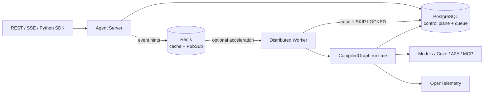

# LingxiGraph

<div align="center">

**面向生产环境的、模型供应商中立的耐久多智能体图运行时**

[English](README.en.md) · [快速开始](Wiki/zh/quickstart/installation.mdx) · [完整文档](Wiki/zh/index.mdx) · [API 参考](Wiki/zh/api/overview.mdx) · [更新日志](CHANGELOG.md)

[](https://github.com/LingXi-Org/LingxiGraph/actions/workflows/ci.yml)
[](https://www.python.org/)
[](LICENSE)
[](CHANGELOG.md)

</div>

LingxiGraph 把普通 Python 函数组装成可持久化、可恢复、可流式观察的状态图。你可以只使用零依赖核心将它嵌入应用，也可以运行完整的 Agent Server、分布式 Worker、PostgreSQL 队列和 Studio 调试界面。

它适合需要长时间运行、人工审批、并行协作、失败恢复与严格多租户隔离的 Agent 工作负载；不绑定任何模型 SDK、提示词平台或云供应商。

## 为什么选择 LingxiGraph

- **确定性图运行时**：Pregel 风格 `plan → execute → commit` 超步；并行任务按编译计划确定性归并。
- **耐久执行**：typed checkpoint、pending writes、历史、replay、fork 与任意深度子图 namespace。
- **模型中立 Agent 层**：中立消息、`ChatModel`、强类型工具、ReAct 预制件、HITL 审批与结构化输出。
- **多智能体模式**：supervisor、handoff、swarm、group chat、plan-execute、parallel review 与 map-reduce。
- **生产控制面**：版本固定、PostgreSQL 租约队列、幂等键、dead-letter/redrive、预算、配额和协作式取消。
- **开放协议**：REST、可续传 SSE、Python SDK、A2A、MCP、Coze 与 OpenAI-compatible 适配器。
- **安全与可观测性**：OIDC/JWT、RBAC、tenant 隔离、PostgreSQL RLS、审计、JSON 日志和 OpenTelemetry。
- **开发者体验**：项目脚手架、本地内存栈、热重载、内嵌 Studio、Docker Compose 与 Helm Chart。

## 30 秒上手

要求 Python 3.11 或更高版本。

```bash
pip install lingxigraph
```

```python
from typing import TypedDict

from lingxigraph import END, START, Runtime, StateGraph


class State(TypedDict):
    request: str
    result: str


class Context(TypedDict):
    tenant: str


def resolve(state: State, runtime: Runtime[Context]):
    runtime.stream_writer({"stage": "resolving"})
    return {"result": f"{runtime.context['tenant']}: {state['request']}"}


builder = StateGraph(State, context_schema=Context, name="support", version="1.0.0")
builder.add_node("resolve", resolve, timeout=30)
builder.add_edge(START, "resolve").add_edge("resolve", END)
graph = builder.compile()

print(graph.invoke(
    {"request": "reset access", "result": ""},
    context={"tenant": "acme"},
))
```

预期输出：

```text
{'request': 'reset access', 'result': 'acme: reset access'}
```

生产副作用应使用 `runtime.idempotency_key` 在下游去重。LingxiGraph 保证状态提交幂等；外部网络调用采用至少一次语义。

## 选择你的运行方式

| 场景 | 安装或命令 | 适用范围 |
| --- | --- | --- |
| 嵌入 Python 应用 | `pip install lingxigraph` | 本地图执行、测试、库集成 |
| 本地 Agent 开发 | `pip install "lingxigraph[server]"` + `lingxigraph dev` | 内存存储、内嵌 Worker、Studio |
| 单服务器生产栈 | `docker compose up --build` | PostgreSQL、Redis、API、Worker、Studio |
| 独立扩展 | `lingxigraph server` / `lingxigraph worker` | 多进程或 Kubernetes 部署 |

创建一个可直接运行的 Agent 项目：

```bash
lingxigraph new my-agent
cd my-agent
pip install -e .
lingxigraph dev
```

打开 `http://localhost:8124/studio/` 查看真实图结构、SSE 执行轨迹、thread 状态、检查点和中断恢复。

## Agent 与工具

核心包不依赖任何模型厂商。模型只需实现 `ChatModel.agenerate()`；支持流式时再实现 `astream()`。工具参数由 Python 类型注解生成 JSON Schema，并可配置权限、secret 注入、超时和人工审批。

```python
from lingxigraph import HumanMessage, create_agent, tool


@tool(permissions=("knowledge:read",), timeout=10)
def search(query: str) -> str:
    """Search the internal knowledge base."""
    return f"result for {query}"


agent = create_agent(model, [search], system_prompt="You are a support agent.")
result = agent.invoke(
    {"messages": [HumanMessage("查找退款规则")]},
    {"tool_permissions": ["knowledge:read"], "max_tool_calls": 4},
)
```

官方适配器按需安装：

```bash
pip install "lingxigraph[coze]"      # Coze Bot / Workflow / ChatModel
pip install "lingxigraph[openai]"    # OpenAI-compatible ChatModel
pip install "lingxigraph[all]"       # 完整服务端与集成依赖
```

## 平台架构



PostgreSQL 是队列、事件与状态的真相来源。Redis 仅用于缓存、限流、取消和事件提示；Redis 故障时任务与 SSE 会退化为数据库轮询，不影响持久状态正确性。

## 文档

完整的双语文档库位于醒目的 [`Wiki/`](Wiki/README.md)，可直接使用 Mintlify 进行本地预览和部署。

| 中文 | English |
| --- | --- |
| [安装](Wiki/zh/quickstart/installation.mdx) | [Installation](Wiki/en/quickstart/installation.mdx) |
| [创建第一个图](Wiki/zh/quickstart/first-graph.mdx) | [Build your first graph](Wiki/en/quickstart/first-graph.mdx) |
| [Agent Server](Wiki/zh/quickstart/agent-server.mdx) | [Agent Server](Wiki/en/quickstart/agent-server.mdx) |
| [核心概念](Wiki/zh/concepts/architecture.mdx) | [Core concepts](Wiki/en/concepts/architecture.mdx) |
| [REST / SSE API](Wiki/zh/api/overview.mdx) | [REST / SSE API](Wiki/en/api/overview.mdx) |
| [生产部署](Wiki/zh/guides/deployment.mdx) | [Production deployment](Wiki/en/guides/deployment.mdx) |
| [安全与可观测性](Wiki/zh/operations/security-observability.mdx) | [Security and observability](Wiki/en/operations/security-observability.mdx) |

本地预览文档：

```bash
cd Wiki
npx mintlify dev
```

## 开发与验证

```bash
git clone https://github.com/LingXi-Org/LingxiGraph.git
cd LingxiGraph
python -m venv .venv
# Linux/macOS: source .venv/bin/activate
# Windows: .venv\Scripts\activate
pip install -e ".[dev,all]"
pytest
ruff check src tests
mypy src/lingxigraph
```

CI 覆盖 Python 3.11 与 3.13，并执行单元/集成测试、Ruff、mypy、80% 分支覆盖率门槛、依赖审计、镜像扫描与 CycloneDX SBOM 生成。PostgreSQL/Redis 集成测试需要 Docker。

## 兼容性与稳定性

- Python：3.11、3.12、3.13。
- API：版本化路径 `/v1`；错误使用稳定 `code` 与 `retryable` 字段。
- 状态：安全 JSON typed serializer；不在生产状态中使用 pickle。
- 发布：graph ID 与 version 固定到每个 run，滚动升级不会改变已排队或暂停的执行。

## 参与贡献

提交更改前请阅读[贡献指南](Wiki/zh/contributing.mdx)。安全问题请不要公开披露；按[安全指南](Wiki/zh/operations/security-observability.mdx)中的流程联系维护者。

## License

LingxiGraph 基于 [MIT License](LICENSE) 发布。
