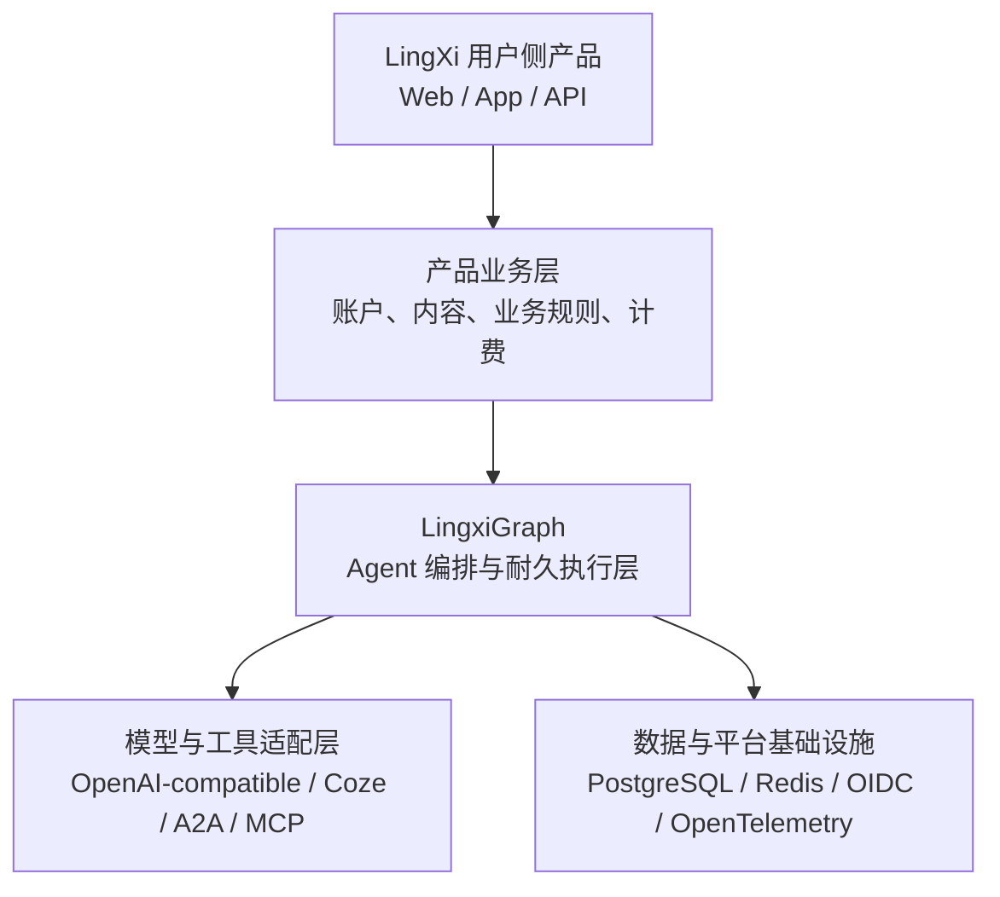
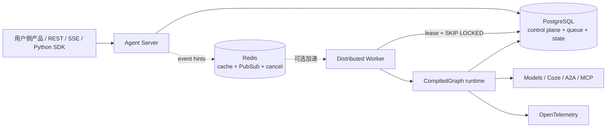

# LingxiGraph

<div align="center">

**LingXi 系列面向用户侧智能产品的 Agent 应用运行底座**

<nav aria-label="语言与文档导航">
  <a href="README.en.md">English README</a> ·
  <a href="Wiki/content/docs/zh/index.mdx">中文文档</a> ·
  <a href="Wiki/content/docs/en/index.mdx">English docs</a> ·
  <a href="Wiki/content/docs/zh/quickstart/installation.mdx">快速开始</a> ·
  <a href="Wiki/content/docs/zh/api/overview.mdx">API 参考</a> ·
  <a href="CHANGELOG.md">更新日志</a>
</nav>

[](https://github.com/LingXi-Org/LingxiGraph/actions/workflows/ci.yml)
[](https://www.python.org/)
[](LICENSE)
[](CHANGELOG.md)

</div>

LingxiGraph 是 LingXi 系列用于构建面向用户的在线 AI 产品能力的生产级 Agent 运行时。它把普通 Python 函数组装成可编排、可持久化、可恢复、可流式观察的状态图，并通过 Agent Server、Worker、PostgreSQL 和开放协议承载真实用户流量。

它位于用户侧产品的业务 API 与模型、工具、数据基础设施之间：负责一次用户请求如何执行、暂停、恢复、重试和审计；不负责终端 UI、业务域规则、计费系统或模型训练。核心不绑定模型 SDK、提示词平台或云供应商，便于 LingXi 系列产品共享运行能力并独立演进。

<table>
  <tr>
    <td width="33%" valign="top"><strong>运行编排</strong><br />将 Agent、工具和业务节点组织成可追踪的状态图。</td>
    <td width="33%" valign="top"><strong>持续执行</strong><br />为多轮会话、长任务、暂停恢复和实时事件提供统一运行语义。</td>
    <td width="33%" valign="top"><strong>平台治理</strong><br />在租户、权限、配额、审计和观测边界内承载产品流量。</td>
  </tr>
</table>

## 在 LingXi 技术栈中的定位


```mermaid
flowchart TB
  Product["LingXi 用户侧产品\nWeb / App / API"] --> BFF["产品业务层\n账户、内容、业务规则、计费"]
  BFF --> Graph["LingxiGraph\nAgent 编排与耐久执行层"]
  Graph --> Providers["模型与工具适配层\nOpenAI-compatible / Coze / A2A / MCP"]
  Graph --> Data["数据与平台基础设施\nPostgreSQL / Redis / OIDC / OpenTelemetry"]
```

| 技术栈层 | 主要职责 | LingxiGraph 的边界 |
| --- | --- | --- |
| 用户侧产品层 | 用户体验、账号、内容、业务流程和商业化 | 通过 REST、SSE 或 Python SDK 接入，不承载产品 UI |
| 产品业务层 | 用户与租户映射、领域数据、计费和策略 | 提供 Agent 所需的 context、工具和授权策略 |
| Agent 运行层 | 图编排、Agent 协作、状态、任务、恢复和观测 | LingxiGraph 的核心职责 |
| 模型与工具层 | LLM、检索、第三方 API 和外部 Agent | 通过 `ChatModel`、Tool、A2A、MCP 和官方适配器接入 |
| 平台基础设施层 | 数据库、缓存、身份、日志和追踪 | 使用 PostgreSQL 作为持久化真相来源，Redis 作为可选加速层 |

## 面向用户侧在线产品的价值

LingxiGraph 面向需要把 Agent 能力稳定交付给大量终端用户的产品与平台团队，重点解决“模型调用能跑起来”之后的工程问题：

- **连续的用户体验**：thread、checkpoint、历史、分支、恢复和可续传 SSE 支持多轮会话、长任务和断线重连。
- **可组合的智能流程**：通过状态图、子图和 supervisor、handoff、swarm、group chat、plan-execute、parallel review 等模式组织复杂任务。
- **可控的生产执行**：图版本固定、租约队列、幂等键、超时、预算、配额、dead-letter/redrive 和协作式取消让重试与扩容可治理。
- **面向租户的安全边界**：OIDC/JWT、RBAC、tenant 隔离、PostgreSQL RLS、审计记录和安全 JSON 状态序列化，为在线产品的数据隔离提供运行时基础。
- **模型与供应商可替换**：模型遵循中立 `ChatModel` 协议；Coze、OpenAI-compatible、A2A 和 MCP 位于可选适配边界，降低供应商锁定。
- **成本与上下文治理**：cache-first prompt、prefix drift 诊断、usage 归一化、历史清理和上下文压缩帮助平台团队控制上下文与调用成本。

典型接入包括多轮智能助手、面向用户的任务型 Agent、需要实时进度的长流程、人工介入的高风险动作，以及多个专业 Agent 协同完成的复杂请求。具体的产品领域逻辑、数据权限和用户界面仍由上层 LingXi 产品负责。

## 能力边界

| 已提供 | 由上层产品或外围平台负责 |
| --- | --- |
| 图与 Agent 的编排、执行、状态和事件 | Web/App UI、用户注册登录和产品导航 |
| Agent Server、分布式 Worker、队列和 Studio | 业务数据模型、内容系统、订单与计费 |
| REST、可续传 SSE、Python SDK、A2A、MCP | 模型账号、供应商合同和模型训练 |
| OIDC/JWT、RBAC、租户隔离、配额和审计 | 生产环境的密钥管理、网络策略和合规流程 |
| PostgreSQL 持久化与 Redis 可选加速 | 不可信租户代码的沙箱执行 |

当前版本不提供在线 Python 上传、多租户代码沙箱或微虚机。Worker 执行镜像或签名制品中注册的可信图；如需运行不可信代码，应在 LingxiGraph 之外使用独立沙箱、最小权限身份和网络出口策略。

## 30 秒上手

要求 Python 3.11 或更高版本。

```bash
pip install lingxigraph
```

```python
from typing import TypedDict

from lingxigraph import END, START, Runtime, StateGraph


class State(TypedDict):
    request: str
    result: str


class Context(TypedDict):
    tenant: str


def resolve(state: State, runtime: Runtime[Context]):
    runtime.stream_writer({"stage": "resolving"})
    return {"result": f"{runtime.context['tenant']}: {state['request']}"}


builder = StateGraph(State, context_schema=Context, name="support", version="1.0.0")
builder.add_node("resolve", resolve, timeout=30)
builder.add_edge(START, "resolve").add_edge("resolve", END)
graph = builder.compile()

print(graph.invoke(
    {"request": "reset access", "result": ""},
    context={"tenant": "acme"},
))
```

预期输出：

```text
{'request': 'reset access', 'result': 'acme: reset access'}
```

生产副作用应使用 `runtime.idempotency_key` 在下游去重。LingxiGraph 保证状态提交幂等；外部网络调用采用至少一次语义，不能依赖运行时自动回滚。

## 选择运行方式

| 场景 | 安装或命令 | 适用范围 |
| --- | --- | --- |
| 嵌入 Python 应用 | `pip install lingxigraph` | 本地图执行、测试、库集成 |
| 本地 Agent 开发 | `pip install "lingxigraph[server]"` + `lingxigraph dev` | 内存存储、内嵌 Worker、Studio |
| 单服务器生产基线 | `docker compose up --build` | PostgreSQL、Redis、API、Worker、Studio |
| 独立扩展 | `lingxigraph server` / `lingxigraph worker` | 多进程或 Kubernetes 部署 |

创建一个可直接运行的 Agent 项目：

```bash
lingxigraph new my-agent
cd my-agent
pip install -e .
lingxigraph dev
```

打开 `http://localhost:8124/studio/` 查看真实图结构、SSE 执行轨迹、thread 状态、检查点和中断恢复。

## Agent、工具与开放 Skills

核心包不依赖任何模型厂商。模型只需实现 `ChatModel.agenerate()`；支持流式时再实现 `astream()`。工具参数由 Python 类型注解生成 JSON Schema，并可配置权限、secret 注入、超时和人工审批。

```python
from lingxigraph import HumanMessage, create_agent, tool


@tool(permissions=("knowledge:read",), timeout=10)
def search(query: str) -> str:
    """Search the internal knowledge base."""
    return f"result for {query}"


agent = create_agent(model, [search], system_prompt="You are a support agent.")
result = agent.invoke(
    {"messages": [HumanMessage("查找退款规则")]},
    {"tool_permissions": ["knowledge:read"], "max_tool_calls": 4},
)
```

LingxiGraph 原生读取开放 Agent Skills 目录，不定义私有格式。Agent 启动时只看到每个 Skill 的 `name` 和 `description`；需要时通过普通 Tool Calling 调用 `read_skill` 和 `read_skill_resource`。Skill 中的 `allowed-tools` 只作为提示，不能绕过工具权限、动态授权、HITL、timeout 或预算。

```python
from lingxigraph import FilesystemSkillSource, HumanMessage, create_agent

agent = create_agent(
    model,
    tools=[search],
    skills=FilesystemSkillSource("skills"),
)
result = agent.invoke({"messages": [HumanMessage("用中文问候我")]})
```

完整示例见 [`skills/hello/SKILL.md`](skills/hello/SKILL.md) 与 [`examples/react_agent_skills.py`](examples/react_agent_skills.py)。

## 稳定 Prompt 前缀与适配器

2.2.0 将 system prompt、固定约束、few-shot 和 canonical tool schema 固定为 `ImmutablePrefix`，把用户消息、检索结果、workspace 状态和 tool result 留在动态后缀。通过 `CacheFirstConfig` 可以启用 prefix drift 校验、history hygiene、context compaction、统一 cache usage 统计和 `cache_telemetry`。现有 `create_agent(model, tools, system_prompt=...)` 调用继续兼容；详细配置见[稳定 Prompt 前缀指南](Wiki/content/docs/zh/guides/cache-first.mdx)和[2.2.0 迁移说明](docs/migration-2.2.md)。

按需安装官方适配器：

```bash
pip install "lingxigraph[coze]"      # Coze Bot / Workflow / ChatModel
pip install "lingxigraph[openai]"    # OpenAI-compatible ChatModel
pip install "lingxigraph[all]"       # 完整服务端与集成依赖
```

## 生产架构


```mermaid
flowchart LR
  Client["用户侧产品 / REST / SSE / Python SDK"] --> API["Agent Server"]
  API --> PG[("PostgreSQL\ncontrol plane + queue + state")]
  API -. "event hints" .-> Redis[("Redis\ncache + PubSub + cancel")]
  Worker["Distributed Worker"] -->|"lease + SKIP LOCKED"| PG
  Redis -. "可选加速" .-> Worker
  Worker --> Runtime["CompiledGraph runtime"]
  Runtime --> PG
  Runtime --> Remote["Models / Coze / A2A / MCP"]
  Runtime --> OTel["OpenTelemetry"]
```

PostgreSQL 是队列、事件与状态的真相来源。Redis 仅用于缓存、限流、取消和事件提示；Redis 故障时任务与 SSE 会退化为数据库轮询，不影响持久状态正确性。生产部署前必须关闭不安全开发认证并配置 TLS/OIDC；API 与 Worker 镜像必须携带一致的 `lingxigraph.json` 和图版本。

## 文档与开发

完整的双语文档库位于 [`Wiki/`](Wiki/README.md)，使用 Next.js/Fumadocs 构建静态站点，并由 GitHub Actions 部署到 Cloudflare Pages。中文与 English 页面保持相同相对路径，下面的每一行都提供对应语言入口。

| 中文 | English |
| --- | --- |
| [安装](Wiki/content/docs/zh/quickstart/installation.mdx) | [Installation](Wiki/content/docs/en/quickstart/installation.mdx) |
| [创建第一个图](Wiki/content/docs/zh/quickstart/first-graph.mdx) | [Build your first graph](Wiki/content/docs/en/quickstart/first-graph.mdx) |
| [Agent Server](Wiki/content/docs/zh/quickstart/agent-server.mdx) | [Agent Server](Wiki/content/docs/en/quickstart/agent-server.mdx) |
| [核心概念](Wiki/content/docs/zh/concepts/architecture.mdx) | [Core concepts](Wiki/content/docs/en/concepts/architecture.mdx) |
| [Agent Skills](Wiki/content/docs/zh/concepts/agent-skills.mdx) | [Agent Skills](Wiki/content/docs/en/concepts/agent-skills.mdx) |
| [REST / SSE API](Wiki/content/docs/zh/api/overview.mdx) | [REST / SSE API](Wiki/content/docs/en/api/overview.mdx) |
| [生产部署](Wiki/content/docs/zh/guides/deployment.mdx) | [Production deployment](Wiki/content/docs/en/guides/deployment.mdx) |
| [安全与可观测性](Wiki/content/docs/zh/operations/security-observability.mdx) | [Security and observability](Wiki/content/docs/en/operations/security-observability.mdx) |

本地预览文档：

```bash
cd Wiki
npm install
npm run dev
# 另一个终端可运行校验与构建
npm run check
npm run build
```

开发与验证：

```bash
git clone https://github.com/LingXi-Org/LingxiGraph.git
cd LingxiGraph
python -m venv .venv
# Linux/macOS: source .venv/bin/activate
# Windows: .venv\Scripts\activate
pip install -e ".[dev,all]"
pytest
ruff check src tests
mypy src/lingxigraph
```

CI 覆盖 Python 3.11 与 3.13，并执行单元/集成测试、Ruff、mypy、分支覆盖率门槛、依赖审计、镜像扫描与 CycloneDX SBOM 生成。PostgreSQL/Redis 集成测试需要 Docker。

## 兼容性、稳定性与许可

- Python：3.11、3.12、3.13。
- API：版本化路径 `/v1`；错误使用稳定 `code` 与 `retryable` 字段。
- 状态：安全 JSON typed serializer；不在生产状态中使用 pickle。
- 发布：graph ID 与 version 固定到每个 run，滚动升级不会改变已排队或暂停的执行。

提交更改前请阅读[贡献指南](Wiki/content/docs/zh/contributing.mdx)。安全问题请不要公开披露；按[安全指南](Wiki/content/docs/zh/operations/security-observability.mdx)中的流程联系维护者。

LingxiGraph 基于 [MIT License](LICENSE) 发布。
