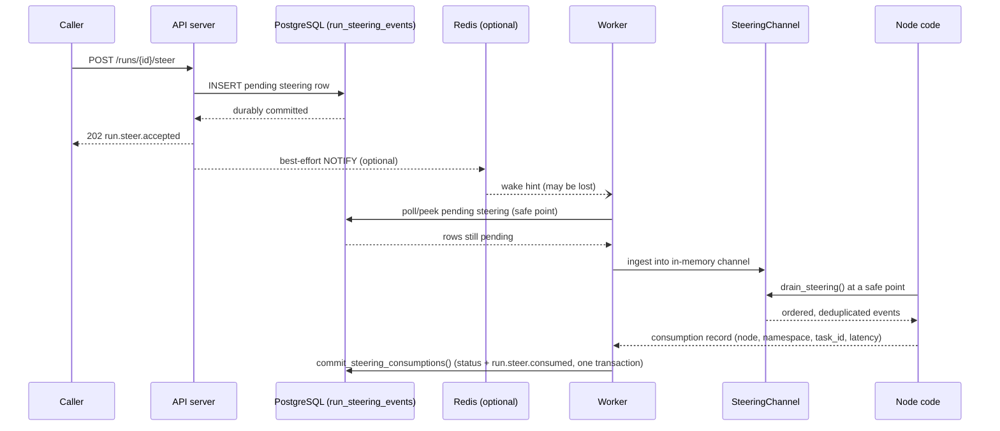

## What problem does steering solve?

A long-running agent run is often not a closed box: a human or another system may want to
hand it new information — "actually reply in Spanish," "the customer just called, priority is
now urgent," "here is the missing API key" — *while the run is still going*, without stopping
it, without waiting for it to reach a natural pause point on its own, and without losing that
input if a worker crashes right after accepting it.

Steering is LingxiGraph's answer: `POST /v1/runs/{run_id}/steer` durably accepts a small piece
of structured JSON and hands it to graph code the next time that code chooses to look for it.
LingxiGraph guarantees the delivery — durable, ordered, deduplicated, exactly-once drain — but
it never decides *what the new input means*. Whether a message means "replan," "just append
to context," or "ignore, we're already past that step" is entirely up to the graph.

## How it differs from cancel, interrupt, and resume

These four mechanisms are easy to conflate because they all touch a run mid-flight, but they
answer different questions:

| Mechanism | Question it answers | Who initiates | What happens to the run |
| --- | --- | --- | --- |
| `cancel` | "Stop this run." | Caller | Run moves to `cancelling` → `cancelled`; execution is torn down, cooperatively |
| `interrupt` | "Graph code needs a value it doesn't have yet, then keep going with it." | Graph code (`interrupt(value)`) | Run moves to `paused`; execution suspends *at that call site* until `resume` supplies a value |
| `resume` | "Continue a paused run with this value." | Caller | A **new** run is created, continuing from where `interrupt` suspended |
| `steer` | "Here is a new piece of input, whenever it's convenient." | Caller | The run keeps executing on its own schedule; the graph decides when/whether to look at the new input |

`interrupt`/`resume` is a *request-response* pattern baked into a specific point in the graph:
the graph explicitly stops and waits, and the caller must supply exactly the value that call
site is waiting for. Steering is the opposite: it is *push*, asynchronous, not tied to any
particular call site, and does not stop anything. A run does not need to be paused, waiting,
or even running yet (a `pending`, not-yet-claimed run also durably accepts steering) to
receive one.

Steering also composes with the other three. A run can be steered while running, steered while
paused (see the durable-transfer section below), and steering never blocks or delays a cancel.

## Data flow: PostgreSQL durable inbox → worker → SteeringChannel → runtime

PostgreSQL's `run_steering_events` table is the single source of truth for every steering
event's existence and status (`pending` → `delivered` → `consumed`, or `superseded` on
transfer). The Redis notification is purely an optimization to reduce polling latency; losing
it never loses a steering event — the worker's periodic safe-point checks fall back to reading
PostgreSQL directly. `SteeringChannel` is the in-process, per-run structure the worker uses to
hand already-fetched events to graph code with atomic drain-once semantics; it is not itself
durable and is rebuilt from PostgreSQL whenever a worker restarts or takes over a run.

## Safe points are application-chosen, not an arbitrary preemption

LingxiGraph never interrupts a node function mid-execution to deliver steering. It guarantees
that whenever graph code calls `runtime.drain_steering()`, the events returned are the current,
freshest, not-yet-drained set — but *where inside a node's code* that call happens is entirely
the application's choice. A node can call it once at the very start, in a loop, or not at all.

What LingxiGraph *does* control is when a node is scheduled as a new task by the executor —
before a node starts, before the next superstep, before a retry, and after a resume — and each
of those transitions is an opportunity for steering ingested since the last one to become
visible. This is a deliberate boundary, not a gap: true preemption of arbitrary user code would
break the deterministic replay guarantees the rest of the runtime depends on.

## Ordering, idempotency, and drain-once

- Steering events for a given run are strictly ordered by an internal `sequence`, assigned at
  durable-accept time.
- `drain_steering()` returns events in that order and never returns the same event twice —
  atomic drain-once, even under retries or worker restarts.
- Deduplication by `idempotency_key`: submitting the same `(tenant_id, run_id,
  idempotency_key)` twice returns the original event instead of creating a second one, and
  that dedup survives a `drain_steering()` call — a retried submission after the original was
  already drained still returns the original (now-consumed) event, not a new pending one.

## Retry, worker crash, and Redis loss

- **Worker retry**: `commit_steering_consumptions()` is idempotent — a worker that commits a
  consumption batch, loses the connection before seeing the ack, and retries the same batch
  will not create a duplicate `run.steer.consumed` event; only steering rows that actually
  transition status in a given call produce one.
- **Worker crash**: because delivery state lives in PostgreSQL, not in the crashed worker's
  memory, a new worker claiming the run reconstructs the picture (`pending`/`delivered` rows)
  from PostgreSQL and continues from there. No steering event is silently dropped by a worker
  crash.
- **Redis loss**: Redis is an accelerator, never a dependency for correctness. If the pub/sub
  notification never arrives — connection reset, Redis restarted, message lost — the worker's
  own periodic PostgreSQL checks at each safe point still discover and deliver the event, just
  with slightly higher latency instead of a lost update.

## Parallel supersteps, `Send`, and subgraphs share one channel

A single run's `SteeringChannel` is shared across every task in the same superstep, including
parallel branches and `Send`-fanned-out tasks, and across subgraph node boundaries within the
same run. Draining is mutually exclusive per event (only one task can ever drain a given event
— no double-processing across parallel tasks) but is not restricted to a single node: any node
anywhere in the run's task graph, at any nesting level, can call `drain_steering()` and see the
same durable, ordered backlog. `queue_latency_seconds` and `task_id`/`namespace` on the
eventual `run.steer.consumed` event record exactly which task, at which subgraph depth, ended
up consuming a given event.

## Consumption vs. checkpoint commit — current scope cut

As of this release, marking a steering event `consumed` (via
`commit_steering_consumptions()`) is a separate durable operation from the graph's own
checkpoint commit for the superstep that drained it. They are not wrapped in one distributed
transaction. In practice this means: if a node drains steering and then the process dies before
its checkpoint is written, the checkpoint-level retry will re-execute the node — but the
steering event was already marked `consumed`, so a re-executed node will not see it again via
`drain_steering()`. Nodes that need the drained payload to survive a mid-superstep crash should
persist what they need from it into state as part of the same node's return value, the same way
they would for any other externally observed input, rather than re-reading it from the
steering channel after a retry. This is a deliberate, currently-shipped scope cut — not a
promise that consumption is checkpoint-transactional — and may be revisited in a future
release.

## What steering explicitly does not do

Steering is a delivery mechanism, not a planning mechanism. It does not:

- decide whether a new message should trigger replanning, cancel a tool call in flight, or
  change the current node's control flow — that is entirely business graph logic;
- guarantee low latency between accept and consume — only that consumption, once it happens,
  is durable and observable via `run.steer.consumed`;
- provide a way to modify already-committed state directly; the graph must explicitly fold a
  drained payload into its own state update.

## Embedded / library-mode degradation

When LingxiGraph is used as an embedded library without the Agent Server (no worker process,
no PostgreSQL-backed repository), `compiled_graph.steer(run_id, ...)` and
`runtime.drain_steering()` still work against an in-process `SteeringChannel`, but durability
degrades to "as durable as the process hosting it": there is no cross-process delivery, no
worker-crash recovery, and no PostgreSQL-backed audit trail of `run.steer.accepted`/
`run.steer.consumed` events. A plain `invoke()` that never touches steering incurs no overhead
and leaks no channel state — see the embedded lifecycle tests referenced from the Agent Server
implementation for the exact guarantees at that layer.
