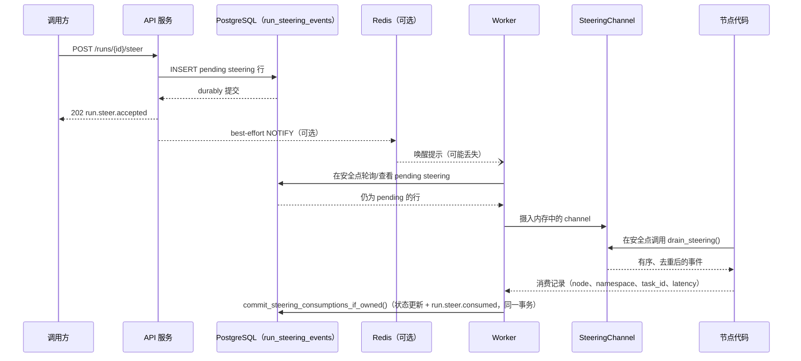

## 要解决什么问题？

一次长时间运行的 agent 执行往往不是一个封闭黑盒：人类或另一个系统可能想在**它仍在执行时**
交给它新的信息——"其实要用中文回复""客户刚打来电话，优先级变成 urgent 了""这是你缺的那个
API key"——而不需要停止它、不需要等它自己走到某个天然的暂停点、也不能因为 worker 在接受
输入之后马上崩溃就把这条输入弄丢。

Steering 就是 LingxiGraph 对这个问题的回答：`POST /v1/runs/{run_id}/steer` durably地
接受一小段结构化 JSON，并在图代码下一次主动查看时把它交给图代码。LingxiGraph 保证的是
**投递**本身——durable、有序、去重、在单个存活的 `SteeringChannel` 内原子 drain-once——
但从不替业务决定"这条新输入意味着什么"。一条消息应该触发重新规划、只是追加到上下文，
还是应该被忽略（因为已经跑过那一步了），完全是业务图的逻辑。具体"drain-once"在跨 worker
崩溃时保证到什么程度、不保证什么，见下方"顺序、幂等与 drain-once"一节。

## 与 cancel、interrupt、resume 的区别

这四个机制都会在运行过程中"介入"一个 run，很容易被混为一谈，但它们回答的是不同的问题：

| 机制 | 回答的问题 | 由谁发起 | 对 run 的影响 |
| --- | --- | --- | --- |
| `cancel` | "停止这个 run。" | 调用方 | run 进入 `cancelling` → `cancelled`；执行被协作式地终止 |
| `interrupt` | "图代码现在需要一个还没有的值，拿到之后再继续。" | 图代码（`interrupt(value)`） | run 进入 `paused`；执行在**那个调用点**挂起，直到 `resume` 提供值 |
| `resume` | "用这个值继续一个已暂停的 run。" | 调用方 | 创建一条**新** run，从 `interrupt` 挂起处继续 |
| `steer` | "这是一条新输入，随时方便的时候看一下。" | 调用方 | run 按自己的节奏继续执行；图决定何时/是否查看新输入 |

`interrupt`/`resume` 是嵌在图内某个特定位置的"请求-响应"模式：图显式停下来等待，调用方
必须提供正好是那个调用点在等的值。Steering 正相反：它是**推送式**的、异步的、不绑定任何
特定调用点，也不会让任何东西停下来。一个 run 甚至不需要处于 `running`（`pending`、还没被
worker claim 的 run 同样能 durably 接受 steering）就能收到一条 steering。

Steering 也可以和另外三者组合使用：一个 run 可以在 running 时被 steer，也可以在 paused
时被 steer（见下方"跨暂停迁移"一节），而且 steering 永远不会阻塞或延迟一次 cancel。

## 数据流：PostgreSQL durable inbox → worker → SteeringChannel → runtime

PostgreSQL 的 `run_steering_events` 表是每一条 steering 事件是否存在及其状态的唯一真相
来源。schema 保留了 `delivered` 这个状态值以便将来扩展，但目前实现的流程从不会写入
它——真实的状态转换是 `pending` → `consumed`（通过一次原子的
`commit_steering_consumptions_if_owned()` 调用直接完成），或者 `pending`/`delivered` →
`superseded`——原因可能是它所属的 paused run 被 resume（其仍 pending 的 steering 被迁移到
新 run），也可能是它在该 run 到达终结 finalization 边界时仍未被消费（原因不止一种，见下文
"终结流程与 steering 准入边界"一节）。请把 `delivered` 当作代码里
可能需要读取/放行的一个状态值，而不是当前任何路径会产生的状态。Redis
通知只是为了降低轮询延迟的优化手段；丢失它从不会丢失一条 steering 事件——worker 在每个
安全点的周期性检查会退化为直接读 PostgreSQL。`SteeringChannel` 是 worker 用来把已取到的
事件以原子 drain-once 语义交给图代码的进程内、按 run 划分的结构；它本身不是 durable 的，
worker 重启或接管一个 run 时会从 PostgreSQL 重新构建它。

## "安全点"由应用选择，不是任意强制抢占

LingxiGraph 从不会在节点函数执行到一半时强行打断它去投递 steering。它保证的是：只要图
代码调用 `runtime.drain_steering()`，读到的就是当前最新、尚未被消费过的事件集合——但
**在节点代码内部的哪一行**调用它，完全由应用决定。一个节点可以在开头调用一次，可以在
循环里反复调用，也可以完全不调用。

LingxiGraph 真正控制的是 executor **何时把一个节点当作新任务来调度**——节点开始前、下一个
superstep 前、重试前、resume 之后——每一次这样的调度切换都是"自上次以来摄入的 steering
变得可见"的机会。这是刻意的设计边界，不是缺口：真正抢占任意用户代码会破坏运行时其余部分
依赖的确定性重放保证。

## 顺序、幂等与 drain-once

- 同一个 run 的 steering 事件按内部 `sequence` 严格排序，序号在 durably accepted 时分配；
- 在**单个存活的 `SteeringChannel`** 内——同一个 worker、同一个进程内实例，跨节点的任意
  次内部重试——`drain_steering()` 永远不会返回同一事件两次：原子 drain-once；
- **这不是系统级的恰好一次保证。** 如果 worker 在 `drain_steering()` 已经把某条事件交给
  节点、但 `commit_steering_consumptions_if_owned()` 尚未把这次消费 durably 记录下来之前崩溃（或
  它的 lease 被重新分配），PostgreSQL 里那一行仍然是 `pending`/`delivered`——接管该 run、
  从 PostgreSQL 重建 channel 的新 worker 会合理地重新投递同一条事件。跨越一次崩溃，
  steering 的投递语义是**至少一次（at-least-once）**，不是恰好一次。如果业务要对 drain
  到的事件执行不可逆的副作用（扣费、有副作用的外部 API 调用），应该用 `event.id`（或者
  经过暂停/恢复迁移后的根 `source_event_id`，见下文）自行做幂等控制，而不能假设
  drain-once 就等于"只处理一次"；
- 通过 `idempotency_key` 去重：对同一个 `(tenant_id, run_id, idempotency_key)` 提交两次
  会返回**原**事件而不是创建第二条；这个去重在 `drain_steering()` 之后依然有效——原事件被
  drain 之后再次重放同一提交，返回的仍然是那条（现已 consumed 的）原事件，而不是一条新的
  pending 事件。这只对 accept 一侧（重复的 `/steer` 调用）去重，本身并不能让跨崩溃的
  drain 一侧变成恰好一次——见上一条；
- consumed-commit（`commit_steering_consumptions_if_owned()`）与图自身为消费它的那个 superstep
  所做的 checkpoint commit 是两个独立的 durable 操作，不是同一个分布式事务（见下方
  "consumption 与 checkpoint commit 的当前关系"）——因此不存在覆盖"steering 投递 + 图
  状态"两者的系统级恰好一次处理保证。

## 重试、worker 崩溃与 Redis 丢失

- **worker 重试：** `commit_steering_consumptions_if_owned()` 是幂等的——一个 worker 提交某批
  consumption 后、在看到 ack 之前连接断开并重试同一批，不会产生重复的
  `run.steer.consumed`；只有在这次调用中真正发生状态转换的 steering 行才会产生一条；
- **worker 崩溃：** 因为投递状态存放在 PostgreSQL 里，而不是崩溃 worker 的内存里，接管该
  run 的新 worker 会从 PostgreSQL（`pending`/`delivered` 行）重新构建完整状态并继续。
  worker 崩溃不会静默丢失任何 steering 事件；
- **Redis 丢失：** Redis 只是加速器，从不是正确性所依赖的东西。如果 pub/sub 通知从未
  到达——连接重置、Redis 重启、消息丢失——worker 自身在每个安全点对 PostgreSQL 的周期性
  检查仍然会发现并投递该事件，只是延迟略高，而不是彻底丢失更新。

## 终结流程与 steering 准入边界

一旦图执行结束，拥有该 run 的 worker 会先原子地封闭新的 steering 准入
（`close_steering()`），然后才开始对图已经消费的内容做最终 durable flush。从这一刻起，
新的 `/steer` 调用会收到一个稳定的 `409 run_finalizing`——因为已经不再存在任何安全点能让
图消费一条新接受的事件。

但这仍然留下一处缺口：某次 `/steer` 调用可能恰好在 `close_steering()` 抢到同一把
run 行锁**之前**先抢到锁并完成 durable 提交——即便此时图早已产生终态输出，本该负责摄入
该事件的心跳循环也早已停止。final flush 完成之后，Runtime 会专门检查这种情况：任何仍处于
`pending`/`delivered` 的 steering 行都会被 durably 转为 `superseded`（原因为
`unconsumed_at_final_boundary`），并伴随一条 `run.steer.superseded` 生命周期事件，二者与该
run 的终结状态写入在**同一个** lease/attempt-fenced 事务中一起提交——不再是两次分别提交、
可能在崩溃或 lease 丢失之间彼此脱节的写入（见 `finalize_run_with_steering_disposition_if_owned`）。
随后该 run 会以之前已经算出的结果（`succeeded`、`paused`、`failed` 等）正常终结——**不会**
仅仅因为存在一条 steering 事件就被强制进入重试循环。

`unconsumed_at_final_boundary` 是一个刻意保持笼统的原因标签，**并不**声称发生了竞争。它
涵盖两种 Runtime 目前无法从现有数据中区分的情况：上面描述的锁竞争，以及更常见的情况——
一个本就合法地从不调用 `drain_steering()` 的图（见上文"安全点由应用选择"，这是文档明确
允许的选择），其对应的行其实一直可见、只是从未被消费。无论哪种情况，结果都一样：该 run
会在第一次投递尝试就正常终结，就像这条 steering 事件从未到达过一样，而该事件的最终归宿会
被记录为 `superseded`，绝不会被静默丢弃。

**最终归宿策略，精确表述如下：** 一个 terminal run **自身**的终结决策绝不能让一条未被消费
的 steering 事件被静默搁置、没有任何 durable、可观测的归宿——这正是上面机制所保证的。但这
**并不**意味着任何 terminal run 在任何情况下都不可能留有 `pending` 的 steering 行：一个耗尽
投递尝试次数而被 dead-letter（或直接 failed）的 run 完全可能合法地留下图根本没来得及消费
的、仍是 `pending` 的 steering——这是刻意保留的 durable 历史记录，而不是 bug；之后如果该
run 被 `/redrive`，这条仍 pending 的行会像任何其他排队中的 steering 一样被重新拾起。但
`/redrive` 只接受 `failed`/`dead_letter` 状态的 run——一次普通的、由客户端发起的
**cancel** 不在这条恢复路径之内：`/redrive` 不接受 `cancelled` 的 run，因此留在
`cancelled` run 上的 `pending` steering 目前没有任何自动的未来投递机会。上面两种归宿情况
与 cancel 不同：边界/未消费归宿之所以存在，是因为那条具体的 steering 事件确实**再也不会
有任何投递机会**去消费它；而 `failed`/`dead_letter` run 未被消费的 steering 仍然拥有一条
合法的未来投递路径（`/redrive`），如果给它打上 `superseded` 反而会错误地堵死这条路径，
这正是为什么它被刻意留作 `pending`。

## 并行 superstep、`Send` 与 subgraph 共享同一个 channel

一个 run 的 `SteeringChannel` 在同一 superstep 内的所有任务之间共享，包括并行分支和
`Send` 扇出的任务，也跨同一 run 内的 subgraph 节点边界共享。drain 对每个事件是互斥的
（一个事件永远只能被某一个任务 drain 到——不存在跨并行任务的重复处理），但并不限定在
某一个特定节点：run 的任务图中任意位置、任意嵌套深度的节点都可以调用
`drain_steering()`，看到的是同一份 durable、有序的积压。最终 `run.steer.consumed` 事件上
的 `queue_latency_seconds` 与 `task_id`/`namespace` 精确记录了究竟是哪个 task、在哪个
subgraph 深度，最终消费了这条事件。

## consumption 与 checkpoint commit 的当前关系（明确的 scope 边界）

在当前版本中，把一条 steering 事件标记为 `consumed`（通过
`commit_steering_consumptions_if_owned()`）与图自身为消费它的那个 superstep 所做的 checkpoint
commit，是两个独立的 durable 操作，**没有**被包在同一个分布式事务里。这在实践中意味着：
如果某个节点 drain 了 steering 之后、其 checkpoint 尚未写入之前进程就退出了，
checkpoint 级别的重试会重新执行该节点——但那条 steering 事件已经被标记为
`consumed`，重新执行的节点通过 `drain_steering()` 不会再次看到它。需要让 drain 到的
payload 在 superstep 中途崩溃后依然存活的节点，应该把需要的内容作为该节点返回值的一部分
持久化进 state（就像对待任何其他外部观测到的输入一样），而不是指望重试后再从 steering
channel 里重新读到它。这是当前版本**刻意**做出的 scope 收窄，不是"consumption 与
checkpoint 是事务性的"这样的承诺，未来版本可能会重新审视这一点。

## Steering 明确不做什么

Steering 是投递机制，不是规划机制。它不会：

- 替业务决定一条新消息是否应该触发重新规划、取消正在进行的 tool 调用，或改变当前节点的
  控制流——这完全是业务图的逻辑；
- 保证 accept 到 consume 之间的低延迟——只保证一旦消费发生，它是 durable 且可通过
  `run.steer.consumed` 观测到的；
- 提供直接修改已提交 state 的方式；图必须显式地把 drain 到的 payload 折叠进自己的
  state 更新里。

## 嵌入式 / library 模式下的降级语义

当 LingxiGraph 作为嵌入式库使用、不经过 Agent Server（没有 worker 进程，没有基于
PostgreSQL 的 repository）时，`compiled_graph.steer(run_id, ...)` 和
`runtime.drain_steering()` 仍然可以对进程内的 `SteeringChannel` 生效，但 durability
会降级为"和承载它的这个进程一样 durable"：没有跨进程投递、没有 worker 崩溃恢复、也没有
基于 PostgreSQL 的 `run.steer.accepted`/`run.steer.consumed` 审计轨迹。一次从未接触
steering 的普通 `invoke()` 不会因此产生任何额外开销，也不会泄漏 channel 状态——该层面的
精确保证参见 Agent Server 实现引用的嵌入式生命周期测试。
