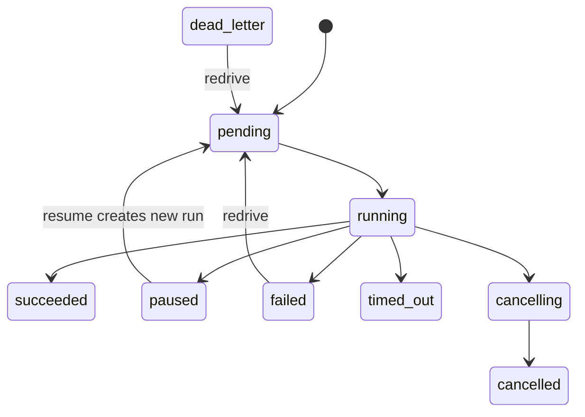

Agent Server defaults to `http://localhost:8124`. Business resources use the versioned `/v1` prefix. Requests and responses are JSON, errors are `application/problem+json`, and run events use SSE.

## Conventions

- Timestamps are timezone-aware ISO 8601 UTC.
- IDs are opaque strings; do not parse their format.
- Unknown request fields are rejected.
- Assistant/Thread/Schedule creation returns `201`; Run creation/resume returns `202`.
- Successful deletion returns `204`.
- Business failure is represented by `run.status` and `run.error`, not replaced by an HTTP status.
- Automated run-creation retries must send a stable `Idempotency-Key`.

## Complete endpoint list

| Method | Path | Purpose |
| --- | --- | --- |
| GET | `/v1/graphs` | List registered graphs |
| GET | `/v1/graphs/{graph_id}` | Get graph; optional `graph_version` |
| GET | `/v1/graphs/{graph_id}/structure` | Get topology, debug metadata, and Mermaid |
| POST / GET | `/v1/assistants` | Create / list assistants |
| GET / PATCH / DELETE | `/v1/assistants/{assistant_id}` | Single-assistant operations |
| POST / GET | `/v1/threads` | Create / list threads |
| GET / PATCH / DELETE | `/v1/threads/{thread_id}` | Single-thread operations |
| GET | `/v1/threads/{thread_id}/state` | Latest or selected checkpoint state |
| GET | `/v1/threads/{thread_id}/history` | Checkpoint history |
| POST | `/v1/threads/{thread_id}/fork` | Fork from historical state |
| POST | `/v1/threads/{thread_id}/runs` | Create a threaded run |
| POST | `/v1/runs` | Create a stateless run |
| GET | `/v1/threads/{thread_id}/runs` | List thread runs |
| GET | `/v1/runs/{run_id}` | Get a run |
| GET | `/v1/runs/{run_id}/join` | Wait up to 300 seconds |
| GET | `/v1/runs/{run_id}/stream` | SSE event stream |
| POST | `/v1/runs/{run_id}/cancel` | Request cooperative cancellation |
| POST | `/v1/runs/{run_id}/resume` | Resume a paused run |
| POST | `/v1/runs/{run_id}/redrive` | Redrive a failed/dead-letter run |
| POST | `/v1/store/batch` | Batch Store operations |
| GET | `/v1/store/search` | Search a namespace |
| POST / GET | `/v1/schedules` | Create / list schedules |
| PATCH / DELETE | `/v1/schedules/{schedule_id}` | Single-schedule operations |
| GET | `/a2a/{assistant_id}/.well-known/agent-card.json` | A2A Agent Card |
| POST | `/a2a/{assistant_id}` | A2A JSON-RPC |
| POST | `/mcp` | MCP JSON-RPC gateway |
| GET | `/health`, `/ready`, `/metrics` | Operations endpoints |

## Run lifecycle

Stable status values are `pending`, `running`, `paused`, `succeeded`, `failed`, `cancelling`, `cancelled`, `timed_out`, and `dead_letter`.

<CardGroup cols={2}>
  <Card title="Authentication and RBAC" icon="key" href="./authentication">Bearer tokens, development API keys, and roles.</Card>
  <Card title="Errors and SSE" icon="triangle-exclamation" href="./errors-events">Stable error codes, resume, and deduplication.</Card>
</CardGroup>
