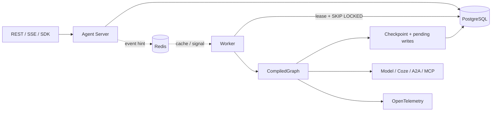
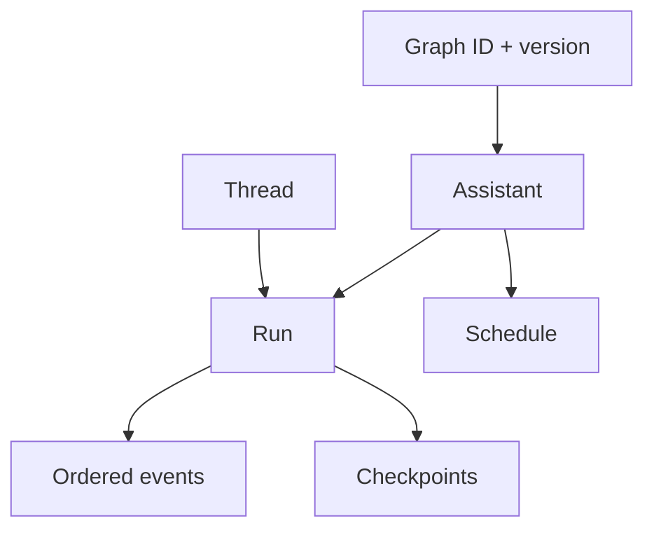

LingxiGraph separates computation semantics from the production control plane. The Python runtime compiles and executes graphs; Agent Server manages tenant resources and enqueues work; workers claim runs pinned to exact graph versions from PostgreSQL.

## Component responsibilities

| Component | Responsibility | Source of truth |
| --- | --- | --- |
| `StateGraph` / `CompiledGraph` | Schemas, topology, execution plan, reducers, node policy | No |
| Agent Server | Auth, Graph/Assistant/Thread/Run APIs, SSE, quotas | Through PostgreSQL |
| PostgreSQL | Control-plane resources, queue, leases, events, checkpoints, Store | Yes |
| Worker | Claim runs, execute pinned versions, heartbeat, retry, drain | No |
| Redis | PubSub, cache, rate limits, cancellation hints | No; degradable |
| Studio | Debug graphs, state, events, checkpoints, and interrupts | No |

## Resource relationships

- A **Graph** is a trusted compiled definition shipped in an image. Multiple versions may share an ID.
- An **Assistant** combines a graph version with default config, context, and metadata.
- A **Thread** is a persistent conversation/state lineage; stateless runs do not need one.
- A **Run** copies graph/version/config/context when created and is unaffected by later assistant edits.
- A **Schedule** stores cron, timezone, and input. Enable schedule execution according to your deployment capabilities.

## Consistency boundary

PostgreSQL is the only recovery source of truth. Events are persisted before delivery, and SSE uses database `sequence` values as IDs. If Redis fails, workers continue polling the queue, while SSE and cancellation fall back to database polling.

Workers use leases instead of permanent locks. Another worker can recover expired work after a process exits. A partial unique constraint prevents two active runs for the same tenant/thread.

<Info>
LingxiGraph does not execute Python uploaded at runtime. Graphs must ship in an image or signed artifact and be registered by `lingxigraph.json`; this is the current trusted execution boundary.
</Info>
