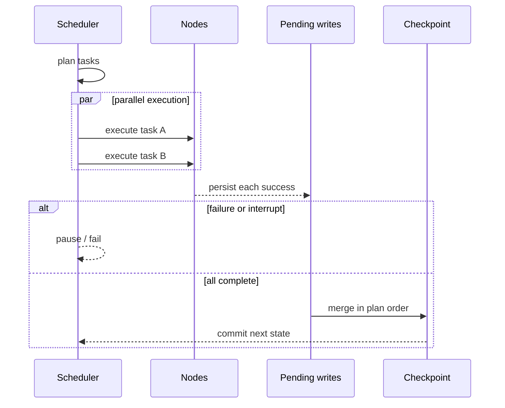

Graphs run as Pregel-style `plan → execute → commit` supersteps. Tasks within a superstep may run concurrently, while reducers always merge updates in compiled plan order. The same input and external results therefore produce stable state.

## Why pending writes matter

When a node succeeds, its result is persisted before sibling nodes finish. If a sibling fails, the process exits, or an interrupt occurs, recovery reuses successful results and executes only missing tasks.

Task identity derives from graph version, base checkpoint, namespace, and task path. It does not include the worker ID or delivery attempt, so lease recovery and run retries still match the original pending write.

## Durability modes

| `durability` | Behavior | Use it for |
| --- | --- | --- |
| `sync` | Write every checkpoint before publishing state | Production default, interrupts, strongest recovery |
| `async` | Ordered background writes with flush on completion/interrupt/exit | Hiding checkpoint latency when limited compute lead is acceptable |
| `exit` | Save only final state when the run ends | Short work that needs no intermediate recovery |

## State versus side effects

LingxiGraph makes checkpoint commits idempotent and prevents duplicate state merges. It cannot roll back an external API call that already happened. When nodes call payment, email, ticketing, or other side-effecting services, send `runtime.idempotency_key` downstream and enforce uniqueness in that service.

<Warning>
External calls have at-least-once semantics. A process may exit after the remote service succeeds but before checkpoint commit. Without downstream deduplication, the side effect can happen twice.
</Warning>

## History, forks, and resume

- `get_state(config)` reads the latest or selected checkpoint.
- `get_state_history(config)` traverses lineage history.
- `fork(config, values, as_node=...)` creates an explicit branch from history.
- `interrupt(value)` produces a durable pause; continue with `Command(resume=...)` or the Run resume API.

Rollback is not a thread concurrency strategy. Create a fork when rerunning from older state so lineage remains auditable and the original history is preserved.
