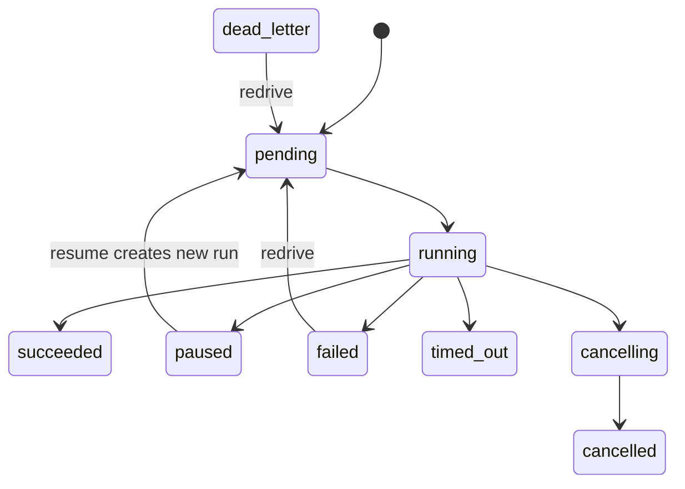

Agent Server 的默认地址为 `http://localhost:8124`。业务资源使用版本化前缀 `/v1`；请求与响应为 JSON，错误为 `application/problem+json`，运行事件使用 SSE。

## 约定

- 时间为带时区的 ISO 8601 UTC；
- ID 为不透明字符串，不要解析其格式；
- 未知请求字段被拒绝；
- 创建 Assistant/Thread/Schedule 返回 `201`；创建/恢复 Run 返回 `202`；
- 资源删除成功返回 `204`；
- 运行的业务失败体现在 `run.status` 和 `run.error`，不由 HTTP 状态替代；
- 自动重试创建 run 时必须使用稳定的 `Idempotency-Key`。

## 完整端点清单

| 方法 | 路径 | 作用 |
| --- | --- | --- |
| GET | `/v1/graphs` | 列出已注册图 |
| GET | `/v1/graphs/{graph_id}` | 获取图；可选 `graph_version` |
| GET | `/v1/graphs/{graph_id}/structure` | 获取拓扑、debug metadata 与 Mermaid |
| POST / GET | `/v1/assistants` | 创建 / 列出 Assistant |
| GET / PATCH / DELETE | `/v1/assistants/{assistant_id}` | Assistant 单资源操作 |
| POST / GET | `/v1/threads` | 创建 / 列出 Thread |
| GET / PATCH / DELETE | `/v1/threads/{thread_id}` | Thread 单资源操作 |
| GET | `/v1/threads/{thread_id}/state` | 最新或指定 checkpoint 状态 |
| GET | `/v1/threads/{thread_id}/history` | checkpoint 历史 |
| POST | `/v1/threads/{thread_id}/fork` | 从历史状态创建 fork |
| POST | `/v1/threads/{thread_id}/runs` | 创建有状态 run |
| POST | `/v1/runs` | 创建无状态 run |
| GET | `/v1/threads/{thread_id}/runs` | 列出 thread runs |
| GET | `/v1/runs/{run_id}` | 获取 run |
| GET | `/v1/runs/{run_id}/join` | 最长 300 秒等待 run |
| GET | `/v1/runs/{run_id}/stream` | SSE 事件流 |
| POST | `/v1/runs/{run_id}/cancel` | 请求协作式取消 |
| POST | `/v1/runs/{run_id}/resume` | 恢复 paused run |
| POST | `/v1/runs/{run_id}/redrive` | 重驱 failed/dead-letter run |
| POST | `/v1/store/batch` | 批量 Store 操作 |
| GET | `/v1/store/search` | namespace 搜索 |
| POST / GET | `/v1/schedules` | 创建 / 列出 Schedule |
| PATCH / DELETE | `/v1/schedules/{schedule_id}` | Schedule 单资源操作 |
| GET | `/a2a/{assistant_id}/.well-known/agent-card.json` | A2A Agent Card |
| POST | `/a2a/{assistant_id}` | A2A JSON-RPC |
| POST | `/mcp` | MCP JSON-RPC gateway |
| GET | `/health`、`/ready`、`/metrics` | 运维端点 |

## Run 生命周期

稳定状态值为 `pending`、`running`、`paused`、`succeeded`、`failed`、`cancelling`、`cancelled`、`timed_out`、`dead_letter`。

<CardGroup cols={2}>
  <Card title="认证与 RBAC" icon="key" href="./authentication">Bearer token、开发 API key 与角色。</Card>
  <Card title="错误与 SSE" icon="triangle-exclamation" href="./errors-events">稳定错误码、续传与去重。</Card>
</CardGroup>
