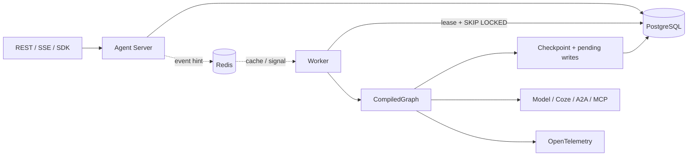
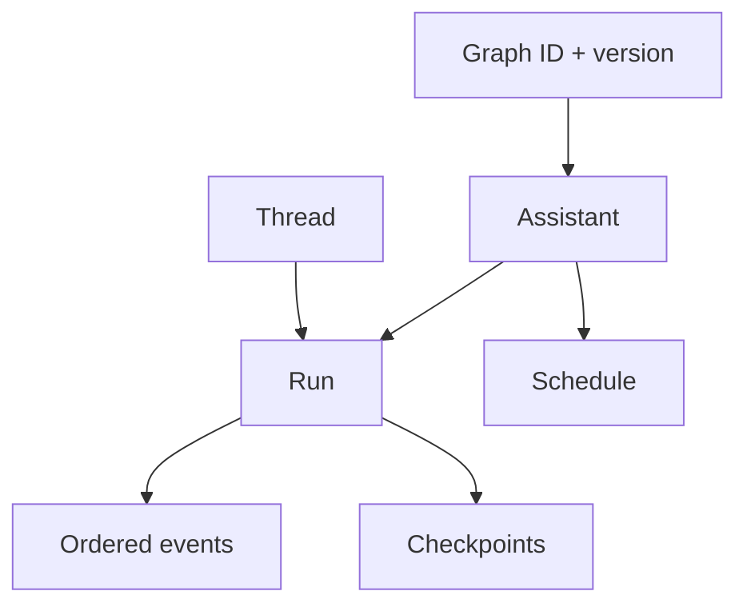

LingxiGraph 将计算语义与生产控制面分离。Python runtime 负责编译和执行图；Agent Server 管理租户资源并入队；Worker 从 PostgreSQL 领取固定版本的 run。

## 组件职责

| 组件 | 职责 | 是否保存真相数据 |
| --- | --- | --- |
| `StateGraph` / `CompiledGraph` | schema、拓扑、执行计划、reducer、节点策略 | 否 |
| Agent Server | 认证授权、Graph/Assistant/Thread/Run API、SSE、配额 | 通过 PostgreSQL |
| PostgreSQL | 控制面资源、队列、租约、事件、checkpoint、Store | 是 |
| Worker | claim run、执行固定图版本、心跳、重试、drain | 否 |
| Redis | PubSub、缓存、速率限制、取消提示 | 否，可降级 |
| Studio | 图、状态、事件、checkpoint 与 interrupt 调试 | 否 |

## 资源关系

- **Graph** 是镜像内受信任的编译定义，可让同一 ID 的多个版本并存。
- **Assistant** 将 graph 版本与默认 config、context、metadata 组合成可调用资源。
- **Thread** 是一条持久会话/状态 lineage；stateless run 可以不使用 thread。
- **Run** 在创建时复制 graph/version/config/context，之后不受 assistant 修改影响。
- **Schedule** 保存 cron、时区和 input；当前平台模型提供管理接口，执行器应按部署能力启用。

## 一致性边界

PostgreSQL 是唯一恢复真相。事件在对外发送前持久化，SSE 以数据库 `sequence` 为 ID。Redis 故障时，Worker 继续轮询队列，SSE 和取消也退化为数据库轮询。

Worker 使用租约而非永久锁。进程退出后，过期 run 可由其他 Worker 回收；同一 tenant/thread 的部分唯一约束防止出现两个 active run。

<Info>
LingxiGraph 不执行用户在线上传的 Python。Graph 必须随镜像或签名制品发布，并由 `lingxigraph.json` 注册；这是当前可信执行边界。
</Info>
