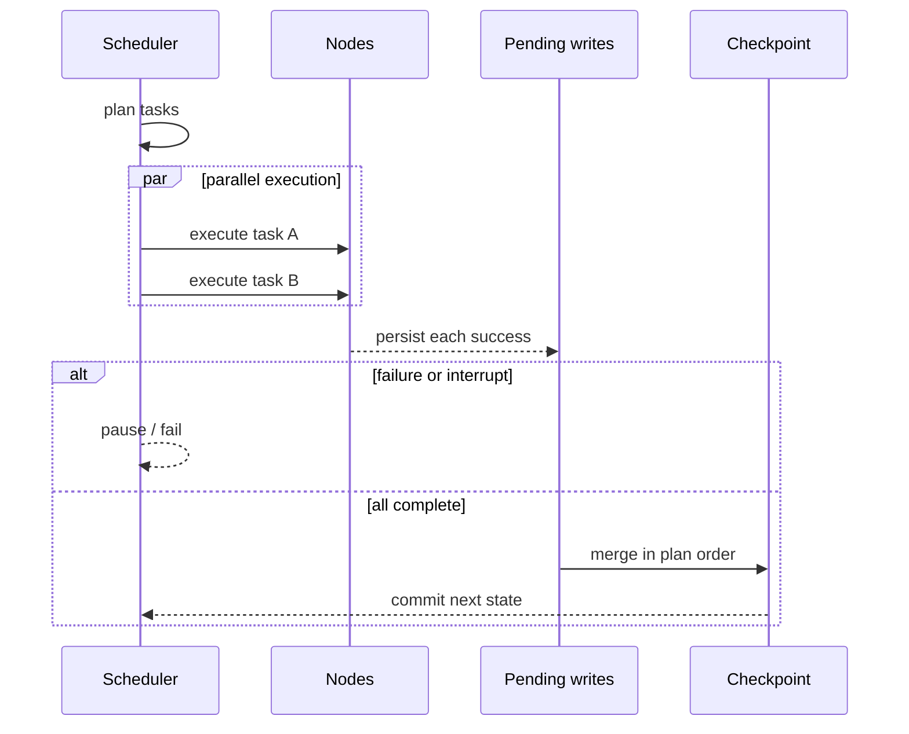

图以 Pregel 风格的 `plan → execute → commit` 超步运行。一个超步中的任务可以并行执行，但更新始终按编译计划顺序通过 reducer 合并，因此相同输入和相同外部结果产生稳定状态。

## Pending writes 为什么重要

节点成功后，其结果在兄弟节点完成前先被持久化。如果同一超步的另一节点失败、进程退出或触发 interrupt，恢复时会复用已成功结果，只重新执行缺失任务。

task identity 由 graph version、基准 checkpoint、namespace 和 task path 生成，不包含 Worker ID 或交付 attempt。这使租约回收和 run 重试仍能命中原 pending write。

## 持久化模式

| `durability` | 行为 | 适用场景 |
| --- | --- | --- |
| `sync` | 状态发布前完成每个 checkpoint 写入 | 生产默认、interrupt、强恢复保证 |
| `async` | 顺序后台写；完成/中断/退出前 flush | checkpoint I/O 较高且可接受短暂计算领先 |
| `exit` | run 结束时只保存最终状态 | 不需要中途恢复的短任务 |

## 状态与副作用

LingxiGraph 保证 checkpoint commit 幂等，并避免重复归并状态；它无法自动撤销已经发生的外部 API 调用。节点调用支付、邮件、工单等有副作用服务时，必须把 `runtime.idempotency_key` 传给下游并在业务侧建立唯一约束。

<Warning>
外部调用采用至少一次语义。进程可能在远端成功之后、checkpoint 提交之前退出；没有下游去重就可能重复产生副作用。
</Warning>

## 历史、fork 与恢复

- `get_state(config)` 获取最新或指定 checkpoint；
- `get_state_history(config)` 按 lineage 读取历史；
- `fork(config, values, as_node=...)` 从历史状态创建明确的新分支；
- `interrupt(value)` 产生耐久暂停，使用 `Command(resume=...)` 或 Run resume API 继续。

回滚不属于 thread 并发策略。需要从旧状态重跑时创建 fork，使 lineage 可审计且不会破坏原历史。
