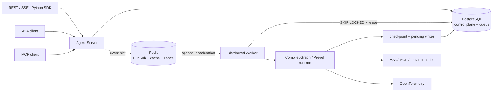
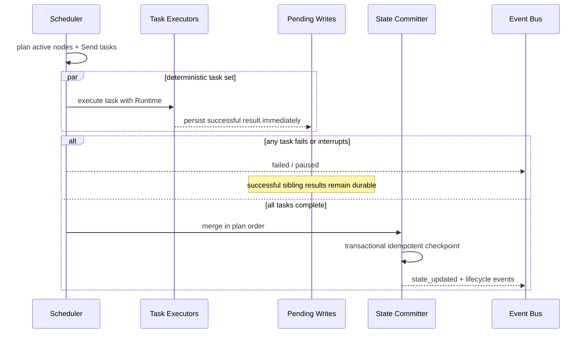

# LingxiGraph v2 架构与运行语义

## 平台边界

LingxiGraph 的核心不绑定 LLM、提示词平台、模型网关或 Agent SDK。节点是普通 callable、
已编译子图、远程 A2A agent 或 MCP tool。基础包保持轻量；FastAPI、PostgreSQL、Redis、
OIDC 与 OpenTelemetry 位于显式可选集成边界。

PostgreSQL 是队列、事件和状态的真相来源。Redis 只承载提示信号、缓存、限流和取消加速；
Redis 故障时 Worker 继续从 PostgreSQL 领取任务，SSE 与取消退化为数据库轮询。

## 编译计划

`StateGraph` 接受独立的 state、input、output 和 context schema。编译阶段会：

1. 从 TypedDict、dataclass 或 Pydantic 提取字段、reducer 与 JSON Schema。
2. 校验节点、静态/条件边、动态 destinations、fan-in 和可达性。
3. 冻结节点策略、边、通道和 graph/schema version hash，返回不可变 `CompiledGraph`。
4. 为服务端清单提供输入、输出和 context schema；无法安全序列化的生产状态立即失败。

普通字段使用 `LastValue`，一个超步内不允许多个任务同时写入；
`Annotated[T, reducer]` 字段按任务计划顺序确定性归并。

registry 以 `(graph_id, graph_version)` 为键，可并存多版本。assistant 选择默认或显式版本；
run 创建时复制 graph/version/config/context，Worker、状态查询和 resume 始终按该快照解析，
滚动发布不会改变队列中或暂停中的执行。

## 耐久超步

每个任务的幂等身份由 graph version、基准 checkpoint、namespace 和 task path 生成，不含
Worker 或本次领取的 run attempt。恢复时先读取同一基准 checkpoint 的 pending writes，
复用已成功结果，仅重新执行缺失/失败/中断任务。

checkpoint 包含 parent lineage、schema/version hash、channel versions、next tasks、动态
Send、pending interrupts、任务快照、run/step 元数据。提交使用唯一约束保证幂等。状态
checkpoint 不会重复归并；外部副作用仍必须按 `runtime.idempotency_key` 去重。

## Runtime 与节点策略

节点签名为 `node(state)` 或 `node(state, runtime)`。`Runtime[Context]` 提供：

- 校验后的 context、不可变 config、长期 Store、Cache；
- 取消 token、deadline、run/task/checkpoint 元数据；
- namespace、稳定幂等键和 custom/messages 事件写入器。
- 父子图共享的模型/工具/token/cost `ExecutionBudget`。

节点可配置异常过滤的指数退避重试、timeout、并发信号量、CachePolicy TTL、destinations、
metadata 和 before/after middleware。interrupt 和 `Command` 是控制流结果，从不缓存。
节点、超步、运行三个层级都检查截止时间与协作式取消。

## 子图与 namespace

子图支持 `invocation`、`thread`、`stateless` 三种持久化模式。checkpoint namespace 使用
可嵌套路径表达父图节点和子图深度，避免拼接伪 thread ID。子图可通过
`Command(scope=PARENT)` handoff 至直接父图。handoff 的状态更新必须显式写在
`Command.update` 中，不会隐式复制全部子图状态；状态查询和事件 envelope 保留 namespace，调用方
可按需折叠或展开。

## 流与事件

流模式统一为 `values`、`updates`、`events`、`custom` 和 `messages`，也可传列表并接收
`(mode, chunk)`。节点 emitter 使用线程安全队列实时泵出；`messages` 载荷是
`(AIMessageChunk|AIMessage, metadata)`。Event envelope 包含
版本、递增 sequence、namespace、run/step/task/checkpoint ID、UTC 时间和 trace/span ID。
Agent Server 先把事件持久化到 `run_events`，再向 Redis 发布提示。SSE 使用数据库 sequence
作为 `id`；客户端重连时传 `Last-Event-ID`，服务端从下一条事件继续。

`get_stream_writer()` 与 `Runtime.stream_writer` 采用 LangGraph 兼容的 `writer(value)`；custom
模式原样交付 value。writer 只产生观察事件，不参与 state reducer，因此实时 token 与超步的
plan/execute/commit 原子性相互独立。节点还在运行时，队列就会把消息交给 consumer；consumer
关闭 iterator 时会取消未完成 task 并传播 cancellation token，避免后台 provider 流泄漏。

## 队列与并发

Worker 使用 `FOR UPDATE SKIP LOCKED` 原子领取最早的 pending run，并写入 lease owner、
expiry 和 attempt。心跳延长租约；过期 running run 回收到 pending。唯一部分索引保证同一
tenant/thread 只有一个 running/cancelling run。

可重试的网络、timeout 和 persistence delivery 失败重新入队；超过 delivery attempt 上限后
进入 `dead_letter`，确定性的 schema/update 错误直接 `failed`。redrive 只接受 failed 或
dead-letter run，并清空错误、lease 和 attempt。Worker 收到 SIGTERM 后停止 claim、等待当前
delivery 完成，超时则由租约恢复。

同线程策略：

- `enqueue`：默认，按创建顺序等待。
- `reject`：发现 active run 时返回稳定的并发错误。
- `cancel_previous`：先标记旧 run cancelling，新 run 排队等待旧租约退出。

历史 rollback 不属于并发策略；使用 checkpoint `fork` 创建明确的新 lineage。

## 持久化模式

- `sync`：每个已提交超步在对外发布状态前完成 checkpoint 写入，生产默认。
- `async`：每个 run 使用单消费者顺序写队列，计算可与 checkpoint I/O 重叠；正常完成、
  中断和退出前设置 flush 屏障，写失败在屏障上浮。
- `exit`：运行结束时保存最终 checkpoint；不适用于需要崩溃恢复或 interrupt 的流程。

SQLite 使用 JSON typed 开发格式，持久化内容不会在加载时执行。
